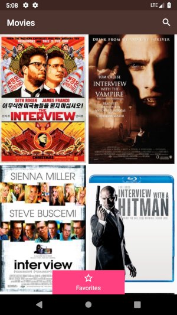
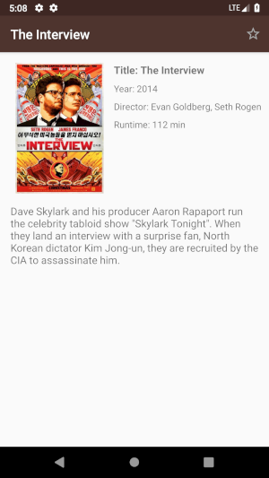
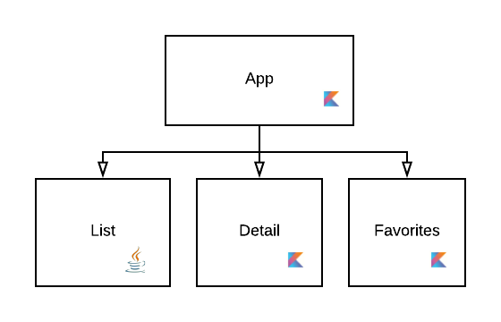

# Introduction

Hello future colleague!

We are a bunch of developers that like to be surrounded with creative and curious people, who thrive on sharing their experiences and learning continuously.
If you are here, it's because you probably have applied to vente-privée as an Android Developer. If not we encourage you to do so, through our [careers site](https://careers.vente-privee.com/en/home-page-en/), we have some open positions for you.
We know that your time is precious, and we don't want you to waste any of it. 
That's why we provide you with this skeleton project so you can show off your dazzling abilities by completing a few challenges listed below.
If you have any suggestions or questions related to this repository, you can contact us or open an issue. We will be happy to answer you.

Good luck!

# About the project
The project uses [OMDb API](http://www.omdbapi.com/) to display a list of movie posters and some details about the selected movie like the runtime, director or the release year.

It contains three gradle modules called `list`, `detail` and `favorites`. `List` module is written in Java and `detail` module is written in Kotlin. 
We left `favorites` module empty to let you make choice of language.

### Technologies
* Architecture - MVVM with [Android Architecture Components](https://developer.android.com/topic/libraries/architecture/)
* Programming languages - Java 8, Kotlin 1.8.0
* Dependency injection - [Dagger 2](https://github.com/google/dagger)
* Images loading - [Glide](https://github.com/bumptech/glide)
* HTTP client - [Retrofit](https://square.github.io/retrofit/)

# Prerequisites
1. [Duplicate this repository](https://help.github.com/articles/duplicating-a-repository/) - please do not fork it ⚠️
2. Generate an API Key. You can do it from [here](http://www.omdbapi.com/apikey.aspx)

# Challenges
1. The Wrong State - we took care of fetching the data remotely from the api. So the app is supposed to show a list of posters, but instead it still displays the progress bar. Can you find where the problem is and fix it? And to make sure we won't make the same mistake twice write a simple unit test.
2. The Lost Event - when the user clicks on an item from the movies list, the app is supposed to display some information about the selected movie (this feature is located in the `detail` module). Currently the app doesn't respond to clicks, can you please fix it?
3. The Lost State - the app comes with a search bar to help users find their favorite movies. Unfortunately, there is a bug. When we rotate the screen, the app clears the text we just typed. Can you provide a solution to prevent this state loss from happening on rotation.
4. Some refreshments - we made sure that this app handles networking errors. But we didn't implement any mechanism to reload the data, without quitting the app. Can you provide a way of refreshing the list of movies?
5. The chosen ones - the favorites screen should show a list of the user's favorite movies. Try to implement this feature. Remember that the list of favorite movies should be available even after killing the app.
6. The Shrink - first start by obfuscating the application using Proguard. Now you should have an empty details view in the app, your mission is to fix these issues. Now the apk is smaller, but we know it can be even smaller, use the apk analyzer to find out how to do so.

### Bonus:
You cracked all of those challenges, and you still can't get enough. We've got you covered, we have some bonus challenges, if you want some extra points, or you can just ignore them and go grab a coffee.

1. Memory leaks - There is a memory leak. Try to find it and fix it.
2. Java to Kotlin conversion - convert `list` module from Java to Kotlin.
3. List loading indicator - The app loads gradually the list of movies. Add a progress bar to indicate that the next page is loading.

### How to send a solution

You can upload your solution to GitHub, BitBucket or any other online repository, and share it with us. You can also send us a .zip file - just remember to clean the project before you zip it.